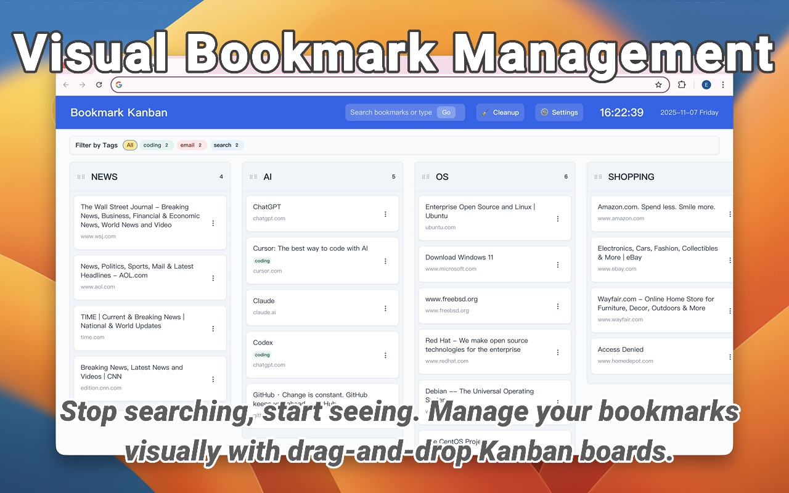
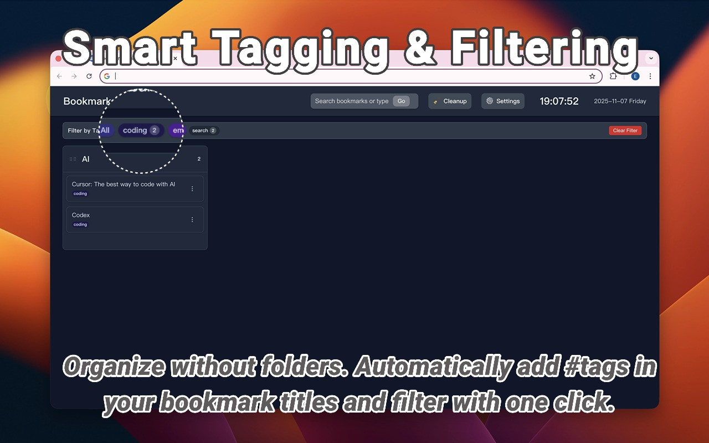
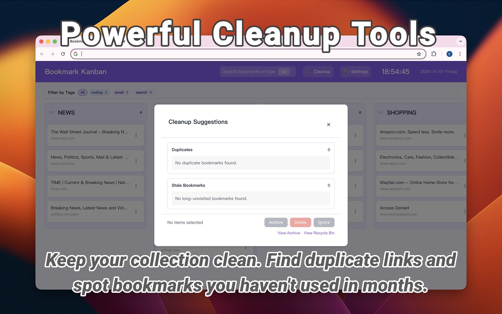
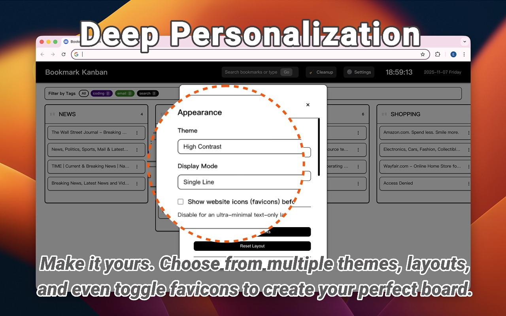
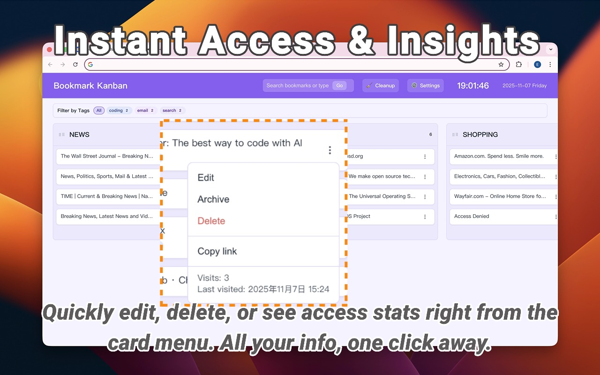

# Bookmark Kanban

A Chrome extension that displays your bookmarks in a visual kanban board layout, making it easier to organize and manage your bookmarks.







## Features

1. **📋 Visual Kanban Board Layout** - Organize bookmarks in a clean, intuitive column-based interface with drag-and-drop functionality

2. **🏷️ Advanced Tag System** - Extract tags from bookmark titles using #hashtags, filter bookmarks by tags, and enjoy theme-aware color palettes with customizable options

3. **🔍 Powerful Command Palette** - VS Code-style quick search for instantly finding and navigating to any bookmark

4. **🎨 Customizable Appearance** - Multiple themes (Default, Dark, Green, Purple, High Contrast) and display modes (single/double line/full wrap)

5. **💾 Layout Persistence** - Automatically saves your custom column and bookmark arrangement across sessions

6. **🔄 Real-time Synchronization** - Instant updates when bookmarks are added, edited, or removed in Chrome

7. **🧹 Smart Cleanup Tools** - Find duplicate bookmarks and manage long-unvisited items with customizable thresholds

8. **⚙️ Extensive Customization** - Control favicon visibility, stale bookmark thresholds, tag palettes, and UI density

> **Important Notice (v2.0.0)**  
> **EN:** The "Dead Link / Site Check" feature has been **removed** in this release. The legacy implementation (and its required `<all_urls>` permission) no longer complies with modern Manifest V3 security & privacy policies. We removed the feature—and its high-risk permissions—to keep the extension 100% safe, private, and compliant. Safe alternatives are being explored for future versions.  
> **ZH:** **此版本已移除“失效链接 / 站点检测”功能。** 旧实现及其依赖的 `<all_urls>` 权限与最新版 Manifest V3 安全/隐私规范不兼容。为了让扩展保持 100% 安全、保护隐私并完全合规，我们已彻底移除该功能及其高风险权限，后续将探索更安全的替代方案。

## Installation

1. Clone this repository or download the source code
2. Open Chrome and go to `chrome://extensions/`
3. Enable "Developer mode" in the top right corner
4. Click "Load unpacked" and select the extension directory

## Usage

The extension operates primarily by replacing your new tab page with a kanban board of your bookmarks:

1. Open a new tab to see your bookmarks displayed in a kanban board layout
2. Drag and drop bookmarks between columns to organize them
3. Click on a bookmark to open it in a new tab
4. Use the edit and delete buttons to manage your bookmarks
5. Access settings by clicking the 'Settings' button in the new tab page header
6. Use the theme selector in the header to switch between different visual themes

## Features in Detail

### Kanban Board Layout
- Bookmarks are organized in columns based on your bookmark folders
- Each column can be reordered by dragging the column header
- Drag and drop bookmarks between columns or within a column
- Visual feedback during drag operations

### Bookmark Management
- Edit bookmark titles and URLs through a modal dialog
- Delete bookmarks with confirmation

### Layout Persistence
- Column order is automatically saved
- Bookmark order within columns is preserved
- Settings are synced through your Chrome account

### Theme System
- Multiple theme options available:
  - Default: Clean and modern light theme
  - Dark: Easy on the eyes dark theme
  - Green: Nature-inspired green theme
  - Purple: Elegant purple theme
  - High Contrast: Accessibility-focused theme
- Theme preference is automatically saved
- System theme detection and auto-switching
- Smooth transitions between themes
- Consistent styling across all components

### Tag System
- **Automatic Tag Extraction**: Tags are automatically extracted from bookmark titles using #hashtags (e.g., "#javascript #tutorial")
- **Real-time Filtering**: Filter bookmarks instantly by clicking on tags in the tag filter bar
- **Theme-Aware Colors**: Tag colors automatically adapt to your selected theme for optimal visibility
- **Customizable Palettes**: Create custom tag color schemes with JSON configuration in Settings > Advanced
- **Case-Insensitive Handling**: "#JavaScript", "#javascript", and "#JAVASCRIPT" are treated as the same tag
- **Tag Management**: Add, remove, and organize tags directly through bookmark titles

*Special thanks to [zwpaper](https://github.com/zwpaper) for the inspiring tag system concept that made this feature possible!* 🙏

### Smart Cleanup System
- **Duplicate Detection**: Advanced algorithm finds duplicate bookmarks with URL normalization
- **Access Frequency Tracking**: On-device tracking shows which bookmarks haven't been visited recently
- **Customizable Thresholds**: Set how long (7-3650 days) before a bookmark is considered "stale"
- **Safe Organization**: Archive and recycle bin features for bookmark cleanup without permanent deletion
- **Privacy-Focused**: All cleanup analysis happens locally without external requests

### User Interface
- Clean and intuitive design
- Responsive layout that adapts to screen size
- Smooth animations and transitions
- Current time and date display
- Favicon visibility toggle for minimal layouts
- Inline visit statistics in bookmark menus

## Development

### Prerequisites
- Chrome browser
- Basic knowledge of HTML, CSS, and JavaScript

### Project Structure
```
bookmark-kanban/
├── js/
│   ├── AppCoordinator.js    # Main application coordinator
│   ├── background.js        # Background service worker
│   ├── popup.js             # Popup window script
│   ├── newtab.js            # New tab page script
│   └── modules/             # Core modules directory
│       ├── ui/              # UI components
│       │   ├── UIManager.js
│       │   ├── BookmarkRenderer.js
│       │   ├── BookmarkActionMenu.js
│       │   ├── ColumnManager.js
│       │   ├── KanbanRenderer.js
│       │   ├── NotificationService.js
│       │   └── UIStateManager.js
│       ├── cleanup/         # Cleanup system modules
│       │   ├── cleanupActions.js
│       │   ├── cleanupConstants.js
│       │   ├── cleanupEngine.js
│       │   ├── cleanupMediator.js
│       │   ├── cleanupRepository.js
│       │   ├── cleanupState.js
│       │   ├── cleanupUIController.js
│       │   ├── cleanupView.js
│       │   ├── cleanupUtils.js
│       │   ├── archiveManager.js
│       │   ├── recycleManager.js
│       │   ├── archivePanelController.js
│       │   └── recyclePanelController.js
│       │   └── cleanupPreferences.js
│       ├── bookmarkManager.js    # Bookmark data management
│       ├── modalManager.js        # Modal dialogs management
│       ├── dragManager.js         # Drag and drop functionality
│       ├── tagManager.js          # Tag system management
│       ├── tagRenderer.js         # Tag rendering components
│       ├── tagPalettes.js         # Tag color palettes
│       ├── themeManager.js        # Theme management
│       ├── displayManager.js      # Display mode management
│       ├── faviconLoader.js       # Favicon loading
│       ├── faviconPreferenceManager.js
│       ├── accessStatsClient.js   # Access frequency tracking
│       ├── accessTracker.js       # Background access tracking
│       ├── eventManager.js        # Event handling
│       ├── messageHandler.js      # Message communication
│       ├── notificationManager.js  # Notification system
│       ├── storageManager.js      # Storage management
│       ├── utils.js               # Utility functions
│       └── Modal.js               # Unified modal factory
├── css/
│   ├── popup.css
│   ├── newtab.css            # Main stylesheet
│   ├── themes.css            # Theme definitions
│   └── modules/              # CSS modules
│       ├── modal-unified.css # Unified modal styles
│       ├── cleanup.css        # Cleanup system styles
│       ├── tags.css          # Tag system styles
│       ├── common.css        # Common utilities
│       ├── drag.css          # Drag and drop styles
│       ├── modal.css         # Legacy modal styles
│       └── commandPalette.css # Command palette styles
├── lib/
│   └── Sortable.min.js       # Third-party drag and drop library
├── icons/
│   ├── icon16.png
│   ├── icon48.png
│   ├── icon128.png
│   └── default-favicon.png   # Default bookmark favicon
├── popup.html
├── newtab.html
├── manifest.json
└── README.md                 # This file
```

### External Libraries
- Sortable.js - Used for drag and drop functionality (https://github.com/SortableJS/Sortable)

### Building
1. Clone the repository
2. Make your changes
3. Test the extension locally
4. Submit a pull request

## Contributing

Contributions are welcome! Please feel free to submit a Pull Request.

1. Fork the repository
2. Create your feature branch (`git checkout -b feature/AmazingFeature`)
3. Commit your changes (`git commit -m 'Add some AmazingFeature'`)
4. Push to the branch (`git push origin feature/AmazingFeature`)
5. Open a Pull Request

## License

This project is licensed under the MIT License - see the [LICENSE](LICENSE) file for details.

## Privacy

This extension does not collect or transmit any personal data. All data is stored locally in your browser or synced through your Chrome account. See our [Privacy Policy](privacy-policy.html) for more details.

## Support

If you encounter any issues or have suggestions, please:
1. Check the [Issues](https://github.com/chenyifeng/bookmark-kanban-extension/issues) page
2. Create a new issue if needed
3. Provide detailed information about the problem

## Acknowledgments

- Chrome Extensions API
- Sortable.js library
- Modern web technologies
- Open source community

## Author

Chen Yifeng

## Version History

- 2.0.0
  - **🏷️ Complete Tag System Implementation**
    - Extract tags automatically from bookmark titles using #hashtags
    - Filter bookmarks by tags with real-time tag filtering interface
    - Theme-aware tag color palettes that adapt to your selected theme
    - Customizable tag palettes with JSON configuration support
    - Case-insensitive tag handling and intelligent tag management

  - **🧹 Enhanced Cleanup Tools**
    - Smart duplicate bookmark detection with advanced URL normalization
    - Local access frequency tracking identifies long-unvisited bookmarks
    - Configurable stale bookmark threshold (7-3650 days)
    - Streamlined Cleanup Lite experience focused on duplicates + stale items
    - Archive and recycle bin management for safe bookmark organization

  - **🎨 Advanced Customization Options**
    - Favicon visibility toggle for ultra-minimal text-only layouts
    - Full display mode (title wrapping) alongside single/double line modes
    - Custom tag palette configuration with theme-specific color schemes
    - UI density controls and extensive personalization settings

  - **⚙️ Technical Infrastructure Overhaul**
    - Unified modal system using factory pattern for consistent behavior
    - Theme-aware color management with real-time adaptation
    - Local visit tracking system without external network requests
    - Improved bookmark action menu with inline visit statistics
    - Performance optimizations and memory management enhancements

  - **🔧 Privacy & Security Improvements**
    - Removed high-risk network permissions for Manifest V3 compliance
    - All data processing remains local and private
    - Simplified permission model reduces security surface
    - Chrome extension favicon API integration for safer icon loading

- 1.2.3
  - Moved theme and display mode selectors to settings page
    - Added settings button with gear icon
    - Created settings modal dialog
    - Improved UI layout and responsiveness
    - Removed keyboard shortcut for settings to avoid conflicts

- 1.2.2
  - Refactored application architecture
    - Split app.js into multiple independent modules
    - Added AppCoordinator.js as application coordinator
    - Added EventManager.js for event handling
    - Added MessageHandler.js for message communication
    - Added NotificationManager.js for notifications
    - Optimized code organization and improved maintainability

- 1.2.1
  - Fixed layout issues
    - Optimized kanban board layout with consistent left margin
    - Removed unnecessary media queries for screen resolution
    - Improved overall layout stability

- 1.2.0
  - Enhanced bookmark availability checking
    - Replaced automatic periodic checks with manual check button
    - Optimized checking algorithm using DNS resolution and favicon checks
    - Added certificate error status display (yellow warning)
    - Implemented parallel checking for improved speed
    - Added progress indicator during checks
    - Used session storage for check results
    - Skipped local network address checks
    - Added 24-hour check cache for better performance

- 1.1.0
  - Added column title editing feature with double-click interaction
  - Added visual feedback for editable and non-editable columns
  - Improved column header interaction with drag handle
  - Enhanced user experience with clear feedback messages

- 1.0.0
  - Added VS Code style command palette for quick bookmark search
  - Enhanced visual feedback for search results across all themes
  - Improved accessibility with high contrast animations
  - Added flexible display modes (single-line and double-line layouts)
  - Simplified interface with clean typography
  - Improved dark theme button styles
  - Unified animation effects across all themes
  - Enhanced overall user experience

- 0.1.2
  - Added theme selection feature with multiple theme options
  - Added system theme detection and auto-switching
  - Improved theme transition animations
  - Added theme persistence

- 0.1.1
  - Update version number in manifest.json
  - Update version display in popup.html
  - Fix modal closing issue with backspace key

- 0.1.0
  - Initial release
  - Visual kanban board for bookmarks
  - Drag and drop functionality
  - Bookmark management features
  - Layout persistence
  - Website availability checking
  - Favicon loading and caching
